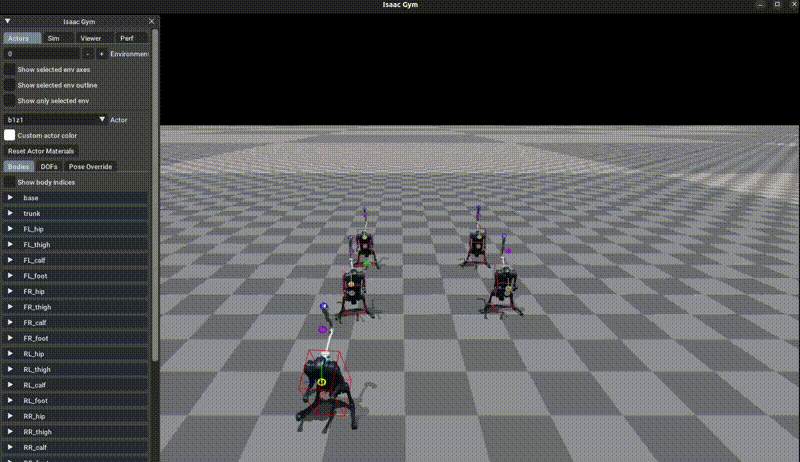

# Isaac Gym Environments for Legged Robots #
This repository provides the environment used to train ANYmal (and other robots) to walk on rough terrain using NVIDIA's Isaac Gym.
It includes all components needed for sim-to-real transfer: actuator network, friction & mass randomization, noisy observations and random pushes during training.  

**Maintainer**: Nikita Rudin  
**Affiliation**: Robotic Systems Lab, ETH Zurich  
**Contact**: rudinn@ethz.ch  

---

# Stand Manipulation

